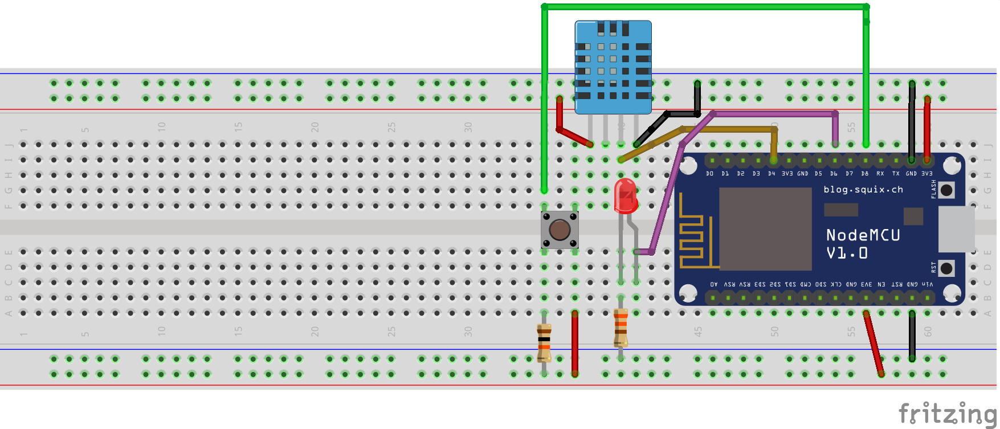
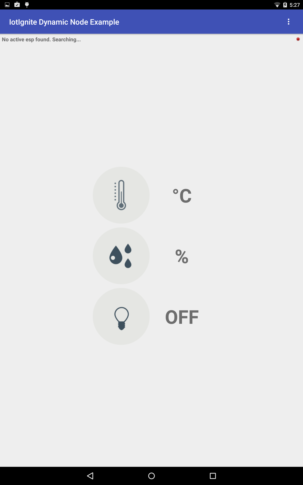
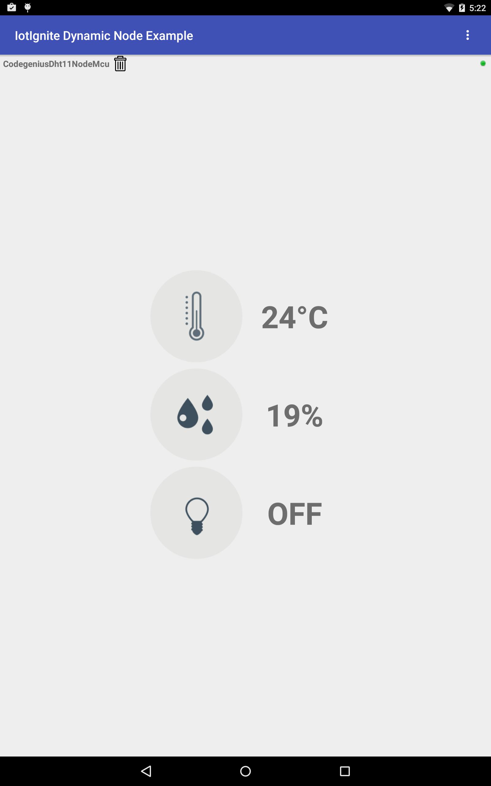
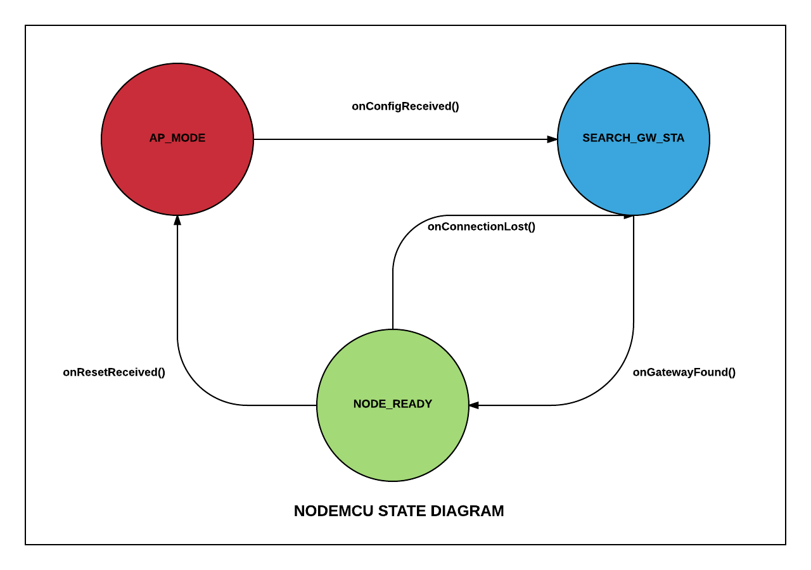

## Dynamic Node Example Project

In this project, we are going to connect an Esp8266 NodeMCU to out customer application running on IoTIgnite gateway. A temparature and humidity sensor is attached to this node. Node gets connected to IoTIgnite over Wifi and then  sends sensor data.

### 1.Preparation

#### _Hardware_

- Esp8266 NodeMCU
- DHT11 Temperature and Humidity Sensor
- LED
- Breadboard
- Push Button
- 10K Ohm Resistor
- 330 Ohm Resistor
- M-M Jumper cables (5 or 6)
- Android IoT Gateway

#### _Software_

- Android Studio (2.0 or above)
- Arduino IDE (1.6.5 or above)
- IotIgniteAgent Application
- Service Provider Application (SPA)
- Arduino IDE ESP Board Installation

_**Local Libraries**_

_Android Specific Libraries:_
- IoT-Ignite-0.7
- HwNodeAppTemplate-1.0

_Arduino Specific Libraries:_
- IgniteIotLibs (Copy under "Arduino/libraries/" directory)
- Esp8266 Sketch Data Upload Plugin


### 2.Installation and Running




Compile Arduino Sketch with __*DynamicNodeExample.ino*__  name, and flash it to NodeMCU. After flashing, NodeMCU is going to run in __AccessPoint__ mode.

Run SPA to register your NodeMCU.

Install IoTIgniteAgent on your Android IoT gateway and license it.
Install DynamicNodeExample application to gateway. Screenshot is as follows when no node is connected:



**When a node is connected:**




### 3.Details


When NodeMCU is flashed for the first time, it starts as a Wi-Fi hotspot. Hotspot name starts with "Ignite" prefix. Configuration sent from SPA to node includes the following parameters:

- NodeID // Customer application registers NodeMCU to IoT Ignite agent with this given unique id. This id should be unique in gateway domain.
- GatewayID // NodeMCU can only be connected to the given gateway id.
- SSID Credentials // Node uses SSID name and password to connect to the local network.


Configured NodeMCU tries to connect to the Wifi network with the given credentials. If an error occurs during Wifi connection, it returns to hotspot mode. If connection is a success, it scans for the gateway with the given gateway id. If maximum of gateway discovery attempts is reached, it returns to hotspot mode. Number of maximum attemps is 30 by default.
When it discovers gateway, it sends node inventory to customer application and waits for data configuration.

All TCP/IP communication between NodeMCU and gateway uses JSON as message format.



```c++
#include <Arduino.h>
#include "IgniteEsp8266WifiManager.h"
#include "IgniteEsp8266ThingHandler.h"

IgniteEsp8266ThingHandler handler;
IgniteEsp8266WifiManager manager(&handler);

void setup() {
  manager.setup();
}
void loop() {
  Serial.println(WiFi.localIP());
  manager.loop();
}
```
You should create a manager and a handler using the given library. In the handler implementation, you can create a thing (sensor/actuator) inventory as below.

In your coding, you are only going to implement sensor data reading function. You do not have to deal with gateway connection and data communication thanks to this library. In the inventorySetup() function, you can register a sensor data reading function. This function handles data to be sent to customer application running on gateway as well as receiving action or configuration messages sent.
IgniteIotLibs library should be added under "Arduino/libraries/" directory.

```c++

void IgniteEsp8266ThingHandler::inventorySetup() {

  // add your custom sensor specs and function here.

  addThingToInventory(SENSOR_DHT11_TEMPERATURE,
                      TYPE_TEMPERATURE,
                      PIN_DATA_DHT11_SENSOR,
                      NOT_ACTUATOR,
                      VENDOR_DHT11,
                      DATA_TYPE_FLOAT, new IgniteEsp8266Timer(readDHTTemperature));

  addThingToInventory(SENSOR_DHT11_HUMIDITY,
                      TYPE_HUMIDITY,
                      PIN_DATA_DHT11_SENSOR,
                      NOT_ACTUATOR,
                      VENDOR_DHT11,
                      DATA_TYPE_FLOAT, new IgniteEsp8266Timer(readDHTHumidity));


  addThingToInventory(ACTUATOR_BLUE_LED,
                      TYPE_LED,
                      PIN_DATA_BLUE_LED,
                      ACTUATOR,
                      VENDOR_BLUE_LED,
                      DATA_TYPE_STRING, new IgniteEsp8266Timer(readLedData));

}

void  IgniteEsp8266ThingHandler::readDHTTemperature() {
  String packet = "";
  String tempData = "";
  float t = dht->readTemperature();
  if (isnan(t)) {
    Serial.println("Failed to read from DHT sensor!");
    return;
  }
  tempData = String(t);

  StaticJsonBuffer<100> jsonBuffer;
  JsonObject& root = jsonBuffer.createObject();
  JsonArray& data = root.createNestedArray("data");

  root["messageType"] = DATA_RESPONSE;
  root["thingId"] = SENSOR_DHT11_TEMPERATURE;
  data.add(tempData);

  root.printTo(packet);

  Serial.println("Temperature :");
  Serial.println(packet);
  packet += "\n";
  sendMessage(packet);
}

void  IgniteEsp8266ThingHandler::readDHTHumidity() {
  String packet = "";
  String humData = "";
  float h = dht->readHumidity();
  if (isnan(h)) {
    Serial.println("Failed to read from DHT sensor!");
    return;
  }
  humData = String(h);


  StaticJsonBuffer<100> jsonBuffer;
  JsonObject& root = jsonBuffer.createObject();
  JsonArray& data = root.createNestedArray("data");

  root["messageType"] = DATA_RESPONSE;
  root["thingId"] = SENSOR_DHT11_HUMIDITY;
  data.add(humData);

  root.printTo(packet);
  Serial.println("Humidity :");
  Serial.println(packet);
  packet += "\n";
  sendMessage(packet);

}

```


#### Customer Application Flow

When Dynamic Node Example application runs, it starts a Network Service Discovery (NSD) service in the background. It also runs a TCP/IP server for the incoming connections. When a node is connected, it registers that node to Ignite agent and starts reading node data in sync with the HwNodeAppTemplate flow. In our sample, Customer Application only implements UI section. All remaining functionality is handled within __*HwNodeAppTemplate*__ library.


```java
@Override
protected void onCreate(Bundle savedInstanceState) {
    super.onCreate(savedInstanceState);
    setContentView(R.layout.activity_main);
    // Start service into HwNodeAppTemplate
    startService(new Intent(this, WifiNodeService.class));
    // Set compability listener.
    WifiNodeService.setCompatibilityListener(this);
    Log.i(TAG, "Dynamic Node Application started...");
    // UI Initialization
    initUIComponents();
    initSensorDatas();

    /* Init Generic Device and Generic Wifi Node Manager these two class instances enough for
    communication.*/
    initEspDeviceAndNodeManager();

}

private void initEspDeviceAndNodeManager() {
    espManager = GenericWifiNodeManager.getInstance(getApplicationContext());

    // Get found device and do the job.
    espManager.addWifiNodeManagerListener(this);

    for (GenericWifiNodeDevice dvc : espManager.getWifiNodeDeviceList()) {
        checkAndUpdateDeviceList(dvc);
    }

}

```
Discovered generic Ignite nodes are handled in WifiNodeManagerListener callback. Library is capable of finding all generic NodeMCUs but in this sample we only handle nodes with __*"DYNAMIC NODE - DHT11 SENSOR"*__ type.

```java
private void checkAndUpdateDeviceList(BaseWifiNodeDevice device) {
    if (DynamicNodeConstants.TYPE.equals(device.getWifiNodeDevice().getNodeType())) {

        Log.i(TAG, "Node Found");
        espNodeList.add(device);
    }
    // Set active ESP and refresh UI
    updateActiveEsp();
}

private void updateActiveEsp() {
    // if only one device found set this device active.
    if (espNodeList.size() == 1) {
        activeEsp = espNodeList.get(0);
    }
    activeEsp.addThingEventListener(espEventListener);
    setUINodeId(activeEsp.getWifiNodeDevice().getHolder().getNodeId());
    isActiveEspConnected = activeEsp.getNode().isConnected();
    setConnectionState(isActiveEspConnected);
}
```


### Please note that:

Arduino specific libraries IgniteIotLibs and HwNodeAppTemplate are only implemented for demonstrating how to connect to an IoTIgnite customer application. According to your needs and requirements, you may use different communication or messaging protocols or a different flow to connect your nodes to your customer application.
